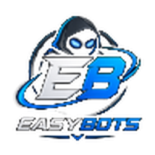

<p align="center">
  
</p>

<h1 align="center">EasyBots</h1>

<p align="center">
  Bots for Old School RuneScape and RuneScape 3.<br>
  Skilling, bossing, and the odd niche job. Every price is listed up front.
</p>

<p align="center">
  <a href="https://ieasyscript.github.io/"><b>Browse the catalogue</b></a>
  &nbsp;·&nbsp;
  <a href="[https://discord.gg/UUwfkXFcub](https://discord.gg/UUwfkXFcub)"><b>Join the Discord</b></a>
</p>

---

## What this is

I write bots for RuneScape and sell them one script at a time. No bundles you don't want, no subscription that covers things you'll never run.

The full catalogue lives on the site above. It has every script, what it does, and what it costs. You can filter by game and by category, so you're not scrolling past RS3 stuff when you only play OSRS.

## What I make

I split everything into three categories.

**Skilling.** The long grinds. Woodcutting, Herblore, Agility, Cooking, that sort of thing. Most of these you set going and leave alone.

**Bossing.** Full kill loops with banking, gear checks and recovery. Sarachnis and Scurrius on OSRS. Rasial, Kerapac and Arch-Glacor on RS3.

**Niche.** The odd jobs. Grand Exchange flipping, account building, and a few tools that help you play manually rather than bot at all.

## Prices

Every script is priced two ways and you pick.

**Monthly.** Renews until you cancel. Good if you want to try something or you only play in bursts.

**Lifetime.** One payment, never expires. Works out cheaper if you're keeping the script around.

Both plans get every update to that script. I don't charge again for fixes or new features. A couple of the tools are free and say so on the card.

## How to buy

1. Pick your script on the site and note the price.
2. Open a ticket in the Discord.
3. Pay there and I'll send your key and the download.

Setup guides come with the key. Each script tells you which client it runs on before you buy, so there are no surprises.

## Support

Bug reports go in the Discord bug channel. If a game update breaks something, that gets patched before anything else I'm working on.

If a script doesn't do what the listing says and I can't fix it inside 72 hours, you get your money back. Bans aren't covered. See below.

## What's in this repo

Just the website. The source for the scripts isn't public and isn't here.

```
index.html        the catalogue site
assets/logo.png   the EasyBots mark
```

## Before you buy anything

Read this properly.

EasyBots is not affiliated with, endorsed by, or associated with Jagex Ltd. RuneScape and Old School RuneScape are trademarks of Jagex Ltd.

Third party clients break Jagex's rules. Using one can get your account permanently banned, and that includes accounts with years of progress on them. I can't appeal a ban for you and I don't refund for one. Run these on accounts you're prepared to lose.

You're using these at your own risk. If you're not comfortable with that, don't buy.
